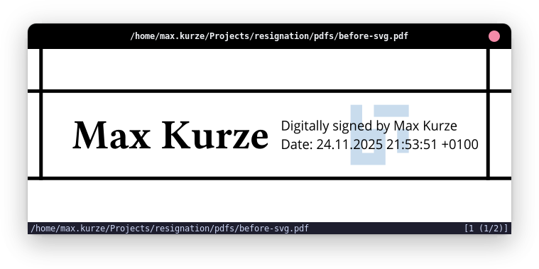
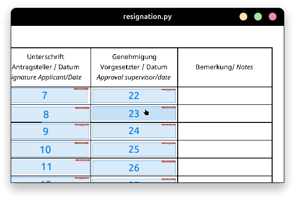
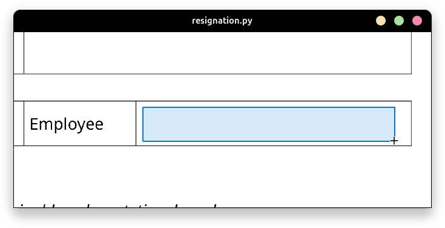

---
# https://vitepress.dev/reference/default-theme-home-page
layout: home
title: ""
hero:
  name: "re[sign]ation"
  # text: "A script to create digital signatures"
  tagline: "A script to create digital signatures"
#   actions:
#     - theme: brand
#       text: Markdown Examples
#       link: /markdown-examples
#     - theme: alt
#       text: API Examples
#       link: /api-examples

# features:
#   - title: Feature A
#     details: Lorem ipsum dolor sit amet, consectetur adipiscing elit
#   - title: Feature B
#     details: Lorem ipsum dolor sit amet, consectetur adipiscing elit
#   - title: Feature C
#     details: Lorem ipsum dolor sit amet, consectetur adipiscing elit
---
This tool is intended to provide a little convenience for creating digitally signed PDFs on Linux.
For that it is based on a couple of existing tools including:

- [pyHanko](https://github.com/MatthiasValvekens/pyHanko) for the creation of the digital/cryptographic part of the signature
- [Typst](https://typst.app/) generation of the visual part

# Why

Most existing tools (at least the dozen I tried) were lacking in one or the other regard. Either
the signatures visual appearance couldn't be configured, or they completely invalidated all existing
signatures when drawing the visuals for a new one.

Additionally, most of them have been rather inconvenient to use.

# Features


<div class="flex lg:flex-row flex-col items-center justify-center lg:gap-16 mb-16">

<div class="sm:max-w-136">

### Customizable Visual Signatures

Define how signatures should look by using a flexible module system. You can create and host your own
appearance templates, or download existing ones, to adapt the signing experience to your needs.

</div>

{.max-w-104! .w-full}

</div>


<div class="flex lg:flex-row-reverse flex-col items-center justify-center lg:gap-16 mb-16">

<div class="sm:max-w-104">

### Visual Field Selection

Choose from existing signature fields through a visual interface and decide which one should be filled.

</div>

{.max-w-128! .w-full}

</div>


<div class="flex lg:flex-row flex-col items-center justify-center lg:gap-16 mb-16">

<div class="sm:max-w-96">

### Interactive Signature Placement

Create and position signature fields through an interactive view, specifying exactly where
each signature should appear.

</div>

{.max-w-112! .w-full}

</div>

# How to use

To use `resignation` you have multiple options.

### Nix Flakes

For use with nix, `resignation` provides a flake that can be run directly through nix:

```
nix run github:maxkurze1/resignation -- \
  --input document.pdf \
  --output document-signed.pdf \
  --template "github:maxkurze1/resignation?dir=templates/logo"
```

For additional information about the available command line options please refer to [CLI](./cli.md).

### PyPI

To install the script via pip execute the following command:
(Use a venv if you don't want to install it globally)

```
pip install git+https://github.com/maxkurze1/resignation
```

Afterward, you should be able to use the `resignation` command
on its own:

```
resignation \
  --input document.pdf \
  --output document-signed.pdf \
  --template "github:maxkurze1/resignation?dir=templates/logo"
```

