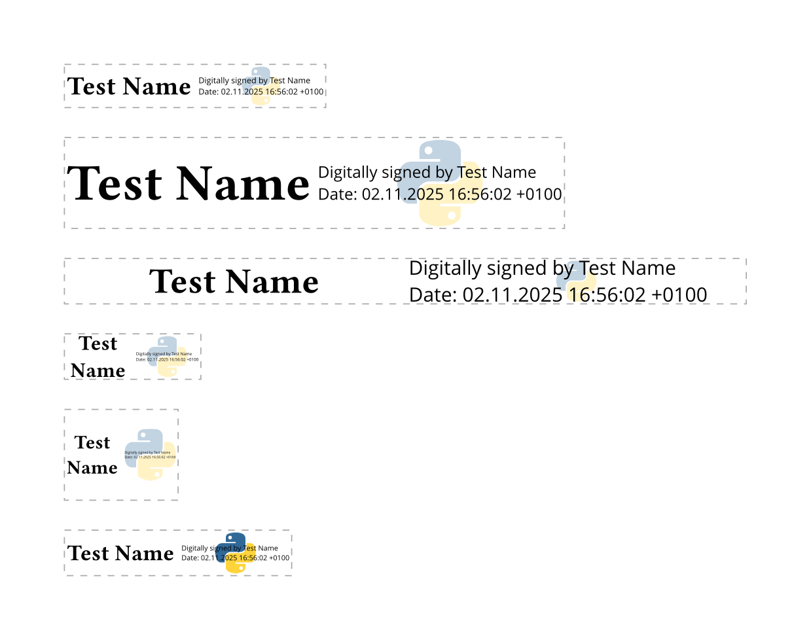

# Logo stamp

This template can be used to create stamps with logos like:

## Params

### stroke

Typst stroke options to outline the whole signature.
(default: `none`)

Example

`stroke='(paint: gray, thickness: 0.5pt, dash: "dashed")'`

### inset

Padding between the signature's box and its content.
(default: `2pt`)

### left

The content that is shown on the left half of the signature.
(default: `name`)

### name

The name that is used for the left half of the signature as
well as for the info on the right.
(default: `{cert_name}`)

### info

The info text that is shown on the right side of the signature.
(default: `[Digitally signed by #{name}\ Date: #{date}]`)

### logo

The content that is shown behind the right half of the signature.
(default: `[]`)

Example:

`logo='image("./TUD-logo-new.svg")'`

### logo_opacity

Opacity of the background logo.

> [!TIP]
> Unfortunately, for the time being,
> this opacity is realized by overlaying a partially-transparent
> white box over the image itself. This may look a bit weird in
> certain editors. Thus, it is recommended to use an image with
> built-in transparency and disable this option by setting it to
> `100%`.

(default: `30%`)

Example:

`logo_opacity='50%'`
